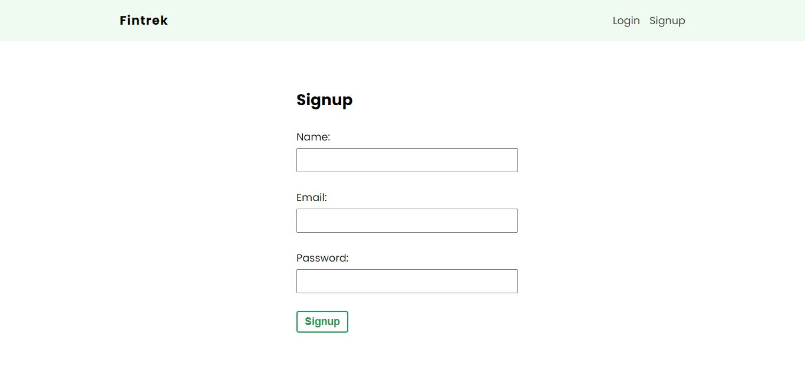
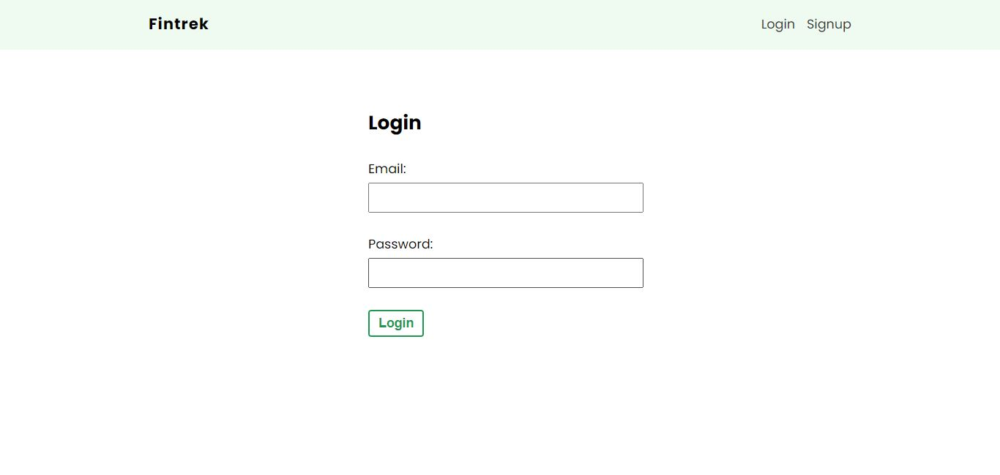
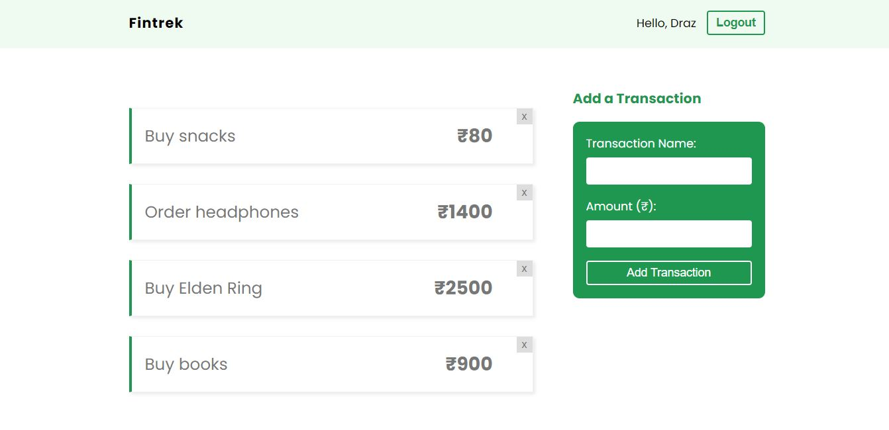

## Fintrek

This project is a finance tracker application built using React and Firebase. It uses React Router to navigate across the login, signup and home page. The Home Page consists of both Transaction Form and Transaction List component. Various hooks are used in order to interact with Firebase Authentication and Database services.

## Features

1. Signup, login and logout. (Implemented using Firebase Authentication)
2. View transaction list of the account in home page.
3. Delete transactions of the account in home page.
4. Add new transactions using transaction form in home page.

## Preview

